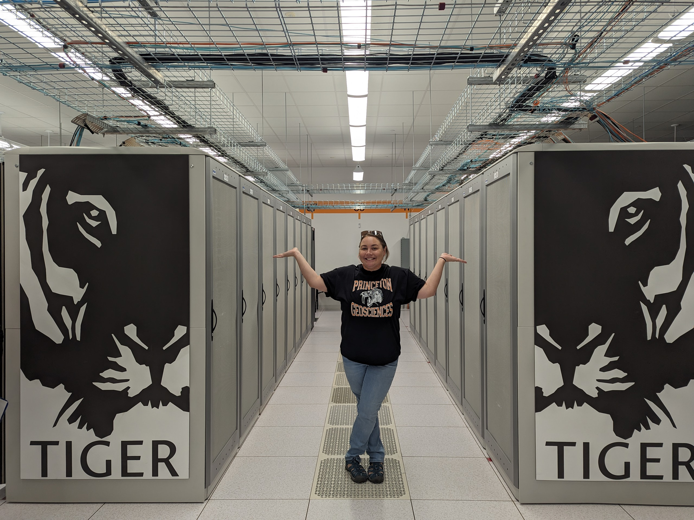
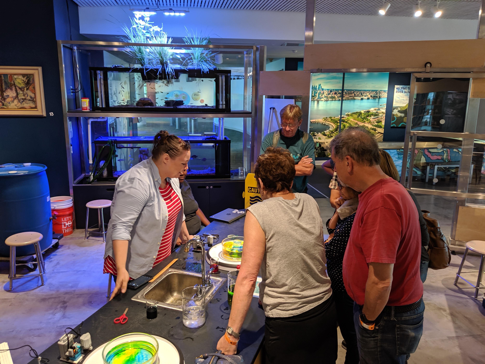
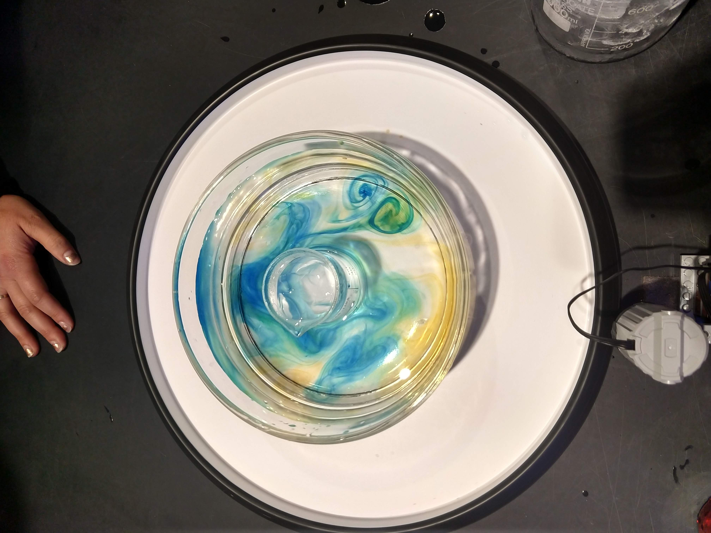
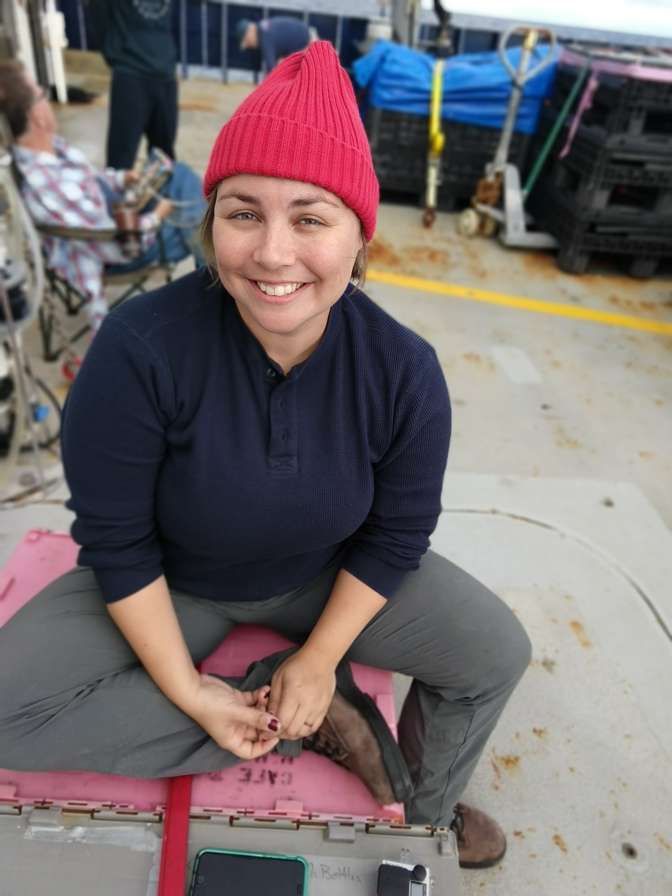

  

 
Hanging out with the TIGER supercomputer that I do my modeling on at Princeton.

  

That's me explaining how Taylor columns form in a rotating fluid at the Independence Seaport Museum.

  

We were able to produce some baroclinic instabilities at our Seaport Museum visit in Philly! 

<video src='../images/VID_20180811_135310728.mp4' width=380/>

  
Timelapse video deploying a pump at sea. 

  

Rocking the Zissou cap my first time at sea on the R/V Sally Ride in 2018.

