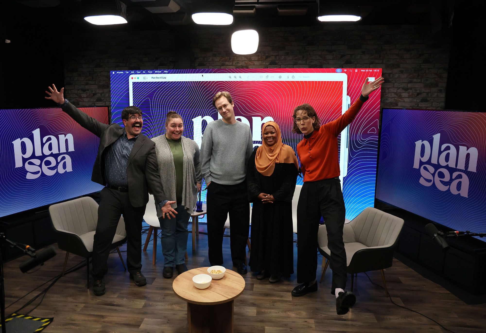

This year at the Ocean Sciences meeting in Glasgow, I had the opportunity to discuss my participation in the <a href="https://www.compassscicomm.org/compass-mcdr-communication-leaders/">COMPASS</a> marine carbon dioxide removal (mCDR) communication leadership cohort on the Plan Sea podcast. Joined by my cohort peers Dr. Mariam Swaleh, who leads the Ocean Climate Innovation Hub in Kenya, and Dr. Kohen Bauer, science director at Ocean Networks Canada, and hosted by Plan Sea's host Anna Madlener and guest cohost, Carbon to Sea’s Senior Manager for Communications, Danny Gawlowski, we discuss the COMPASS workshop, communicating science, and the challenges of mCDR and climate science. 

Listen or watch 
<a href="https://plansea.buzzsprout.com/2141111/episodes/18875011-scientific-communication-with-compass-mcdr-communication-leaders-at-osm-2026">here</a> and let me know what you think!
